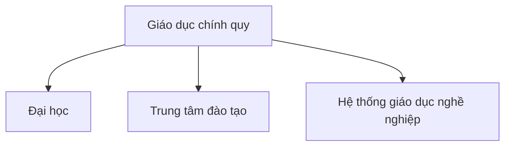
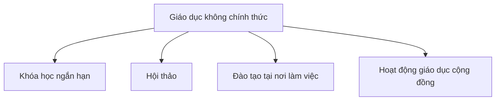
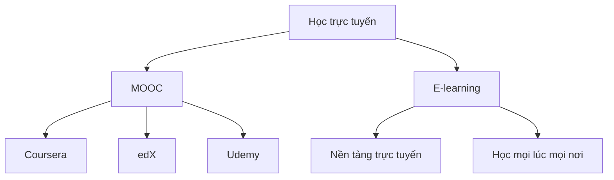
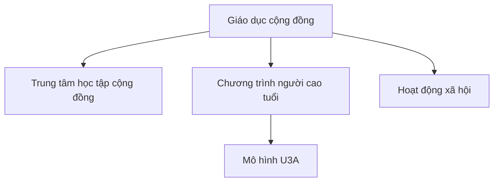
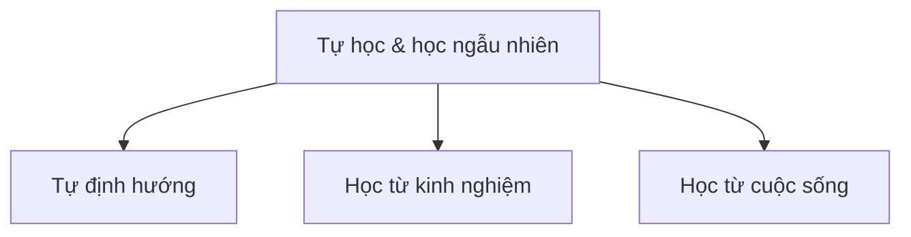

```mermaid
graph TD
    %% Sơ đồ 1: Giáo dục chính quy
    A[Giáo dục chính quy] --> A1[Đại học]
    A --> A2[Trung tâm đào tạo]
    A --> A3[Hệ thống giáo dục nghề nghiệp]
```

```mermaid

graph TD
    %% Sơ đồ 2: Giáo dục không chính thức
    B[Giáo dục không chính thức] --> B1[Khóa học ngắn hạn]
    B --> B2[Hội thảo]
    B --> B3[Đào tạo tại nơi làm việc]
    B --> B4[Hoạt động giáo dục cộng đồng]
```

```mermaid
graph TD
    %% Sơ đồ 3: Học trực tuyến
    C[Học trực tuyến] --> C1[MOOC]
    C1 --> C1a[Coursera]
    C1 --> C1b[edX]
    C1 --> C1c[Udemy]
    C --> C2[E-learning]
    C2 --> C2a[Nền tảng trực tuyến]
    C2 --> C2b[Học mọi lúc mọi nơi]
```

```mermaid
graph TD
    %% Sơ đồ 4: Giáo dục cộng đồng
    D[Giáo dục cộng đồng] --> D1[Trung tâm học tập cộng đồng]
    D --> D2[Chương trình người cao tuổi]
    D2 --> D2a[Mô hình U3A]
    D --> D3[Hoạt động xã hội]
```

```mermaid

graph TD
    %% Sơ đồ 5: Tự học & học ngẫu nhiên
    E[Tự học & học ngẫu nhiên] --> E1[Tự định hướng]
    E --> E2[Học từ kinh nghiệm]
    E --> E3[Học từ cuộc sống]
```

```mermaid

graph TD
    %% Sơ đồ 6: Thách thức
    F[4. Thách thức] --> F1[Bất bình đẳng xã hội]
    F1 --> F1a[Khác biệt tầng lớp]
    F1 --> F1b[Rào cản về giới và tuổi]
    F1 --> F1c[Chi phí cao]
    F1 --> F1d[Đầu tư công hạn chế]

    F --> F2[Hạ tầng và công nghệ]
    F2 --> F2a[Chất lượng không đồng đều]
    F2 --> F2b[Tiếp cận công nghệ hạn chế]
    F2 --> F2c[Kỹ năng số không đồng đều]
    F2 --> F2d[Cơ sở vật chất thiếu thốn]

    F --> F3[Thách thức thể chế]
    F3 --> F3a[Hệ thống giáo dục cứng nhắc]
    F3 --> F3b[Rào cản thủ tục]
    F3 --> F3c[Thiếu chính sách hỗ trợ]

    F --> F4[Thách thức từ người học]
    F4 --> F4a[Thiếu động lực]
    F4 --> F4b[Khó khăn về thời gian]
    F4 --> F4c[Thiếu tự tin]

    F --> F5[Thách thức từ doanh nghiệp]
    F5 --> F5a[Công nghệ thay đổi nhanh]
    F5 --> F5b[Chi phí đào tạo cao]
    F5 --> F5c[Khó duy trì học liên tục]
```

```mermaid
graph TD
    G[5. Cơ hội] --> G1[Công nghệ số]
    G1 --> G1a[Nền tảng học trực tuyến]
    G1 --> G1b[AI và Big Data]
    G1 --> G1c[Công cụ học tập số]
    G1 --> G1d[Cá nhân hóa học tập]

    G --> G2[Phát triển bền vững]
    G2 --> G2a[Kỹ năng xanh]
    G2 --> G2b[Bảo vệ môi trường]
    G2 --> G2c[Phát triển kinh tế]
    G2 --> G2d[Tăng khả năng cạnh tranh]

    G --> G3[Hợp tác đa bên]
    G3 --> G3a[Hợp tác công-tư]
    G3 --> G3b[Hợp tác quốc tế]
    G3 --> G3c[Hợp tác cộng đồng]

    G --> G4[Phát triển cá nhân]
    G4 --> G4a[Nâng cao thu nhập]
    G4 --> G4b[Mở rộng cơ hội việc làm]
    G4 --> G4c[Phát triển kỹ năng]
    G4 --> G4d[Nâng cao chất lượng sống]

    G --> G5[Xây dựng xã hội học tập]
    G5 --> G5a[Bình đẳng cơ hội]
    G5 --> G5b[Lực lượng lao động chất lượng]
    G5 --> G5c[Thích ứng với thay đổi]
```
