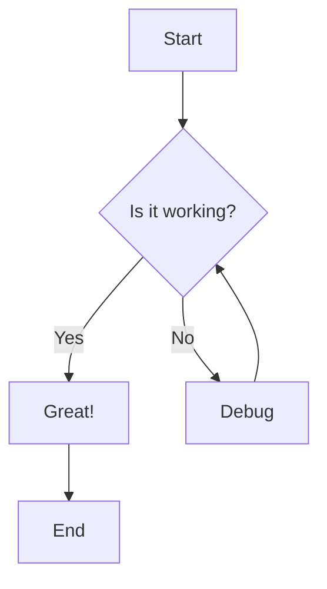
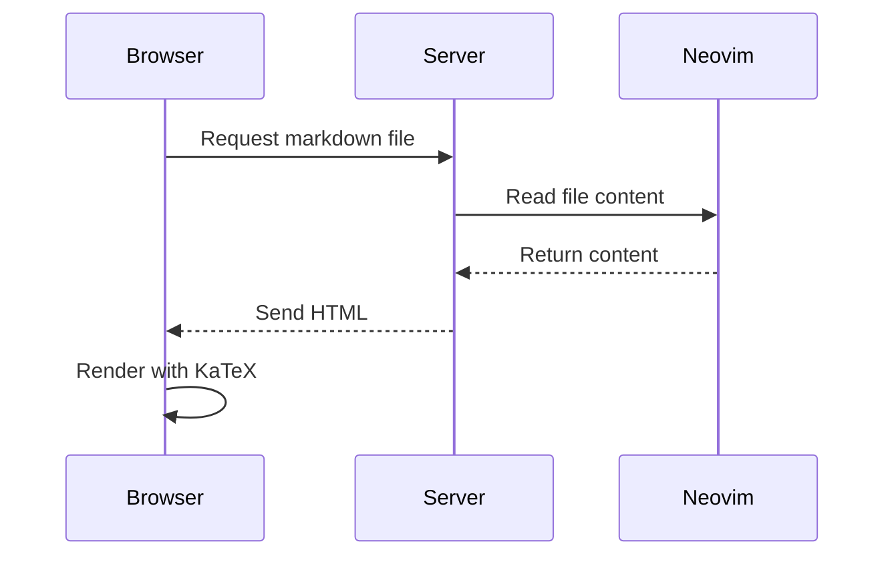

# Mermaid Test

This file tests if mermaid diagrams still work after our changes.

## Simple Flowchart

## Sequence Diagram

## Test with Math

Here's some inline math: $E = mc^2$

And a block equation:
$$
\begin{cases}
x + y = 10 \\
x - y = 2
\end{cases}
$$

Both should work together!
