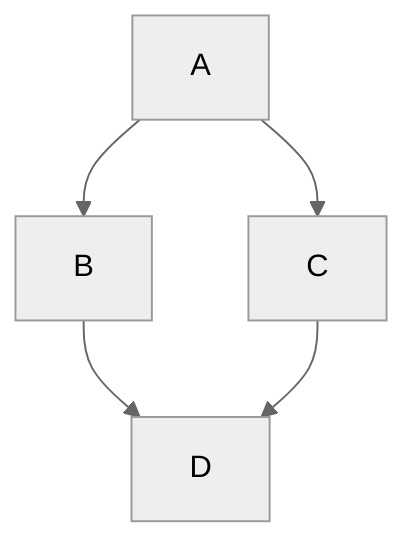

# like to contribute to this project, please feel free to open an issue
$E = mc^2$


```python
for i in range(10):
    try:
        print(i)
    except:
        pass
print("Hello, World!")
```

# Welcome to My Project! 🎉

## Features ✨
- Fast and lightweight ⚡
- Easy to use 😊
- Open-source 🔓

## Installation 🛠️
To install the project, run the following command:

```bash
git clone https://github.com/your-username/your-project.git

